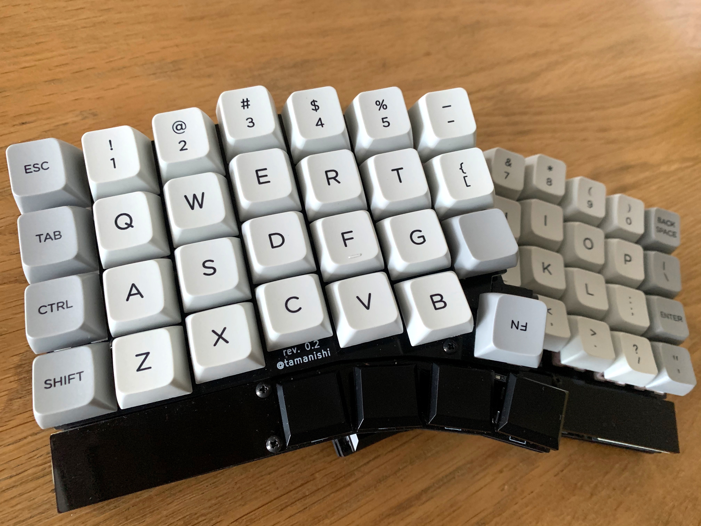
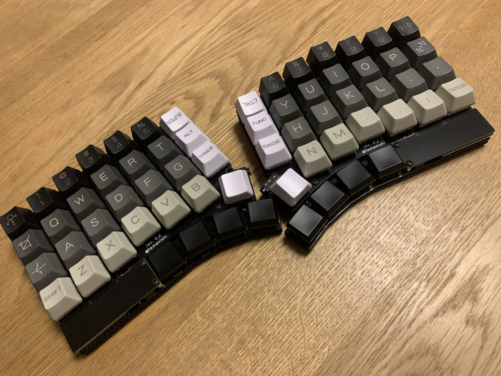
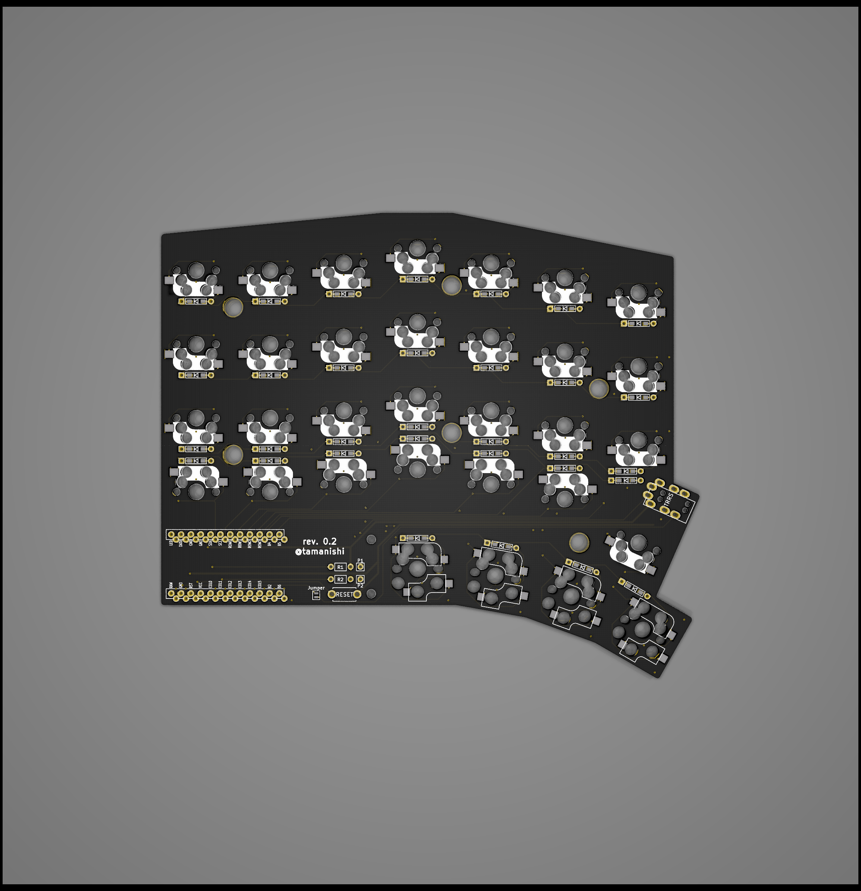
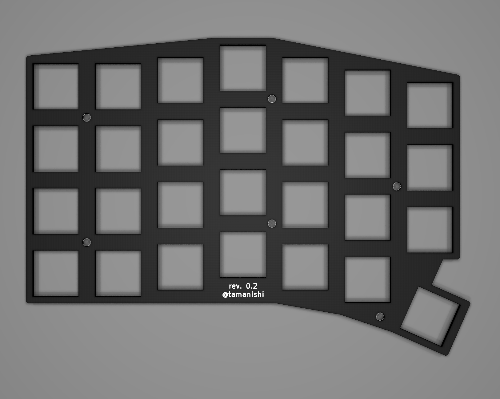
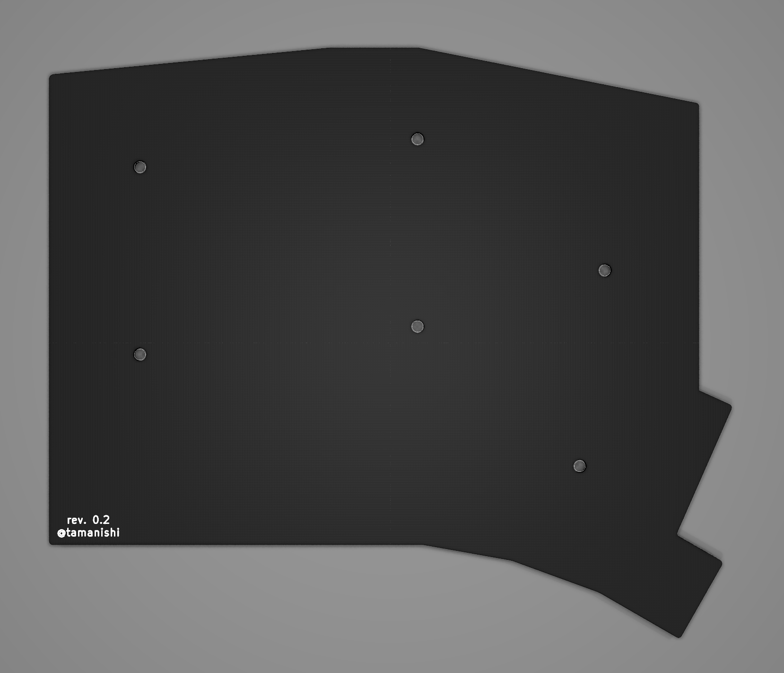
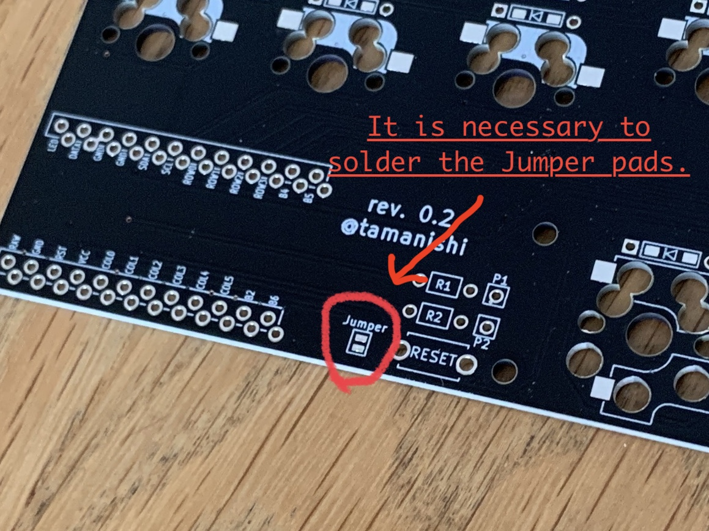

# Pinky4

A split 4 x 7 vertically staggered keys and 4 thumb keys keyboard.  
An idea is inspired from [crkbd](https://github.com/foostan/crkbd), [Lily58](https://github.com/kata0510/Lily58), [Ergo42](https://github.com/Biacco42/Ergo42) and [Helix](https://github.com/MakotoKurauchi/helix).  
Pinky4 is designed for PoC.

# Pcb & Plates

# Bill of Materials (for both hands)
| # | name | qty |
| ---: | :--- | ---: |
| 1 | pcbs | 2 |
| 2 | top plates | 2 |
| 3 | bottom plates | 2 |
| 4 | Pro Micros | 2 |
| 5 | 2 pins tact switches | 2 |
| 6 | TRRS connectors | 2 |
| 7 | diodes (1N4148 or 1N4148W) | 64 |
| 8 | Kailh PCB Sockets (MX Sockets) | 56 |
| 9 | Kailh PCB Sockets (Choc Sockets) | 8 |
| 10 | Cherry MX compatible keyswitches | 56 |
| 11 | Kailh low profile (Choc) keyswitches | 8 |
| 12 | Cherry MX compatible keycaps | 56 |
| 13 | Kailh low profile (Choc) compatible keycaps | 8 |
| 14 | TRS or TRRS cable | 1 |
| 15 | 7mm M2 standoffs (for top and bottom plates) | 12 |
| 16 | 5mm M2 standoffs (for Pro Micro cover plates) | 4 |
| 17 | 4mm M2 screws | 32 |
| 18 | rubber cushions | 8 |

# Notes

# Firmware
See [Quantum Mechanical Keyboard Firmware](https://qmk.fm) and [its Pinky support page](https://github.com/qmk/qmk_firmware/blob/master/keyboards/pinky/readme.md)

## TODOs
- [x] add images
- [x] add BOM
- [ ] add build log
